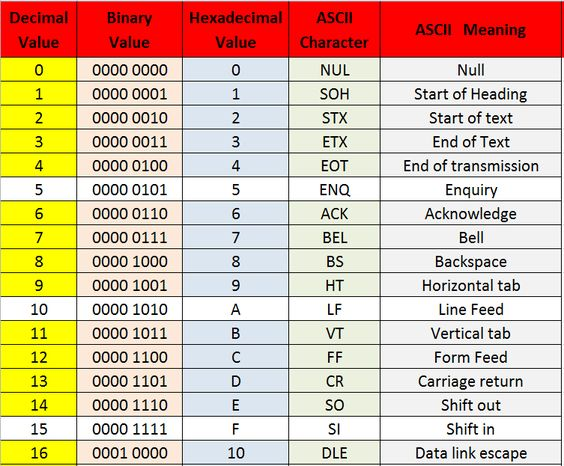
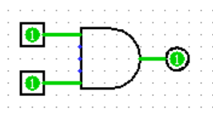
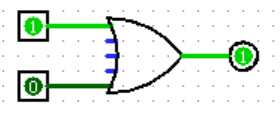
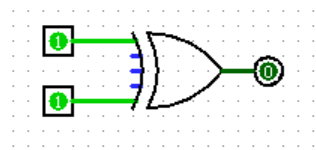
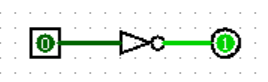
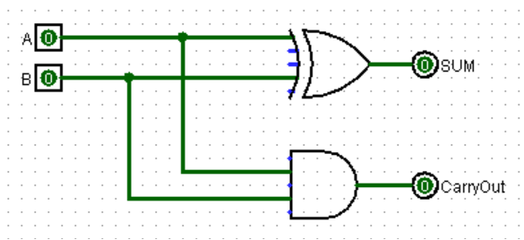
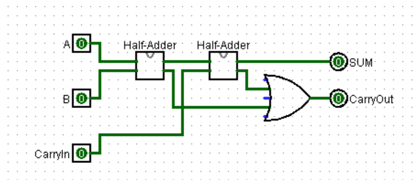

# Hexadecimal

* *A more compact way of representing binary values*
* Hexadecimal is **Base16**
* 4 bits can be represented by *one* alpha-numeric hex character

**Hexadecimal Reference Table**

* Typically Hexadecimals are indicated by a hex code `0x` beginning a hex vale
    * A value of `15` would be written as `0xF`

* Similarly, binary values are often indicated by a `0b` at the start
    * A value of `15` would be written as `0b00001111` for an 8-bit representation

### Overflow
* Would detect in an unsigned binary addition operation if there is a carryout in the **left-most bit**

* Would detect in a signed binary addition operation if the two operands
    * Are the same sign
    * The sign of the sum is different

# Digital Logic Gates

### AND

| A | B | OUT |
|---|---|-----|
| 0 | 0 |  0  |
| 0 | 1 |  0  |
| 1 | 0 |  0  |
| 1 | 1 |  1  |

### OR

| A | B | OUT |
|---|---|-----|
| 0 | 0 |  0  |
| 0 | 1 |  1  |
| 1 | 0 |  1  |
| 1 | 1 |  1  |

### XOR

| A | B | OUT |
|---|---|-----|
| 0 | 0 |  0  |
| 0 | 1 |  1  |
| 1 | 0 |  1  |
| 1 | 1 |  0  |

### NOT

| IN | OUT |
|----|-----|
|  0 |  1  |
|  1 |  0  |

## Adders 

### Half-Adder:

| A | B | SUM | CarryOut |
|---|---|-----|----------|
| 0 | 0 |  0  |  0  |
| 0 | 1 |  1  |  0  |
| 1 | 0 |  1  |  0  |
| 1 | 1 |  1  |  1  |

### Full-Adder:

| A | B | CarryIn | SUM | CarryOut |
|---|---|---------|-----|----------|
| 0 | 0 |  0      |  0  |  0  |
| 0 | 1 |  0      |  1  |  0  |
| 1 | 0 |  0      |  1  |  0  |
| 1 | 1 |  0      |  1  |  1  |
| 0 | 0 |  1      |  1  |  0 |
| 0 | 1 |  1      |  0  |  1  |
| 1 | 0 |  1      |  0  |  1  |
| 1 | 1 |  1      |  1  |  1  |

# 

**We want to be adding larger values however**

