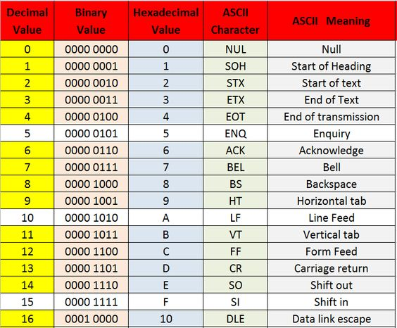

# Instruction Word Basics

**Basic Reference**:

| Instruction Type | Immediate? | sw  | lw | 2bits | 3bits | 3bits | 3bits  |
|------------------|------------|-----|----|-------|-------|-------|--------|
|   R - Type       |      0     |  0  | 0  |  OP   | WA    |  RA1  |   RA2  |
|   I - Type       |      1     |  0  | 0  |  OP   | WA    |  RA1  |   IMM  |
|   LW (Load Word) |      1     |  0  | 1  |  OP   | WA    |  RA1  | OFFSET |
|  SW (Store Word) |      1     |  1  | 0  |  OP   | RA2   |  RA1  | OFFSET |

# Writing Instructions into Logisim Circuits

There comes a point in your logisim journey where you have enough inputs for you now full CPU that manually inputing the 
full instruction word becomes impractical.

This is where assembly eventually comes in.

You can replace the N-bit instruction input with an RAM component (located under the memory folder)

* There are two parameters, Address Bit Width and Data Bit Width
    * You will want your Data Bit Width to be the same length as the instruction word was. ( For lab 4 use 14 bits )

* For Address Bit Width use the bit-width for address in your instruction word.
    * For Lab 4's 14-bit instruction word, the Bit width for Read Address 1 and 2 as well as Write Address is 3 

# Hex Files / Instructions

You will notice that the digit length inside the ram is not in line with binary instruction length. Thats because
the RAM module takes instructions formatted as HEXADECIMAL instructions. This is a decent way for conedensing down long
binary instruction words.

* To encode a command set, you will need to create a file with the extension `.hex`
* At the top of the hex file, ensure you have the header: `v2.0 raw`
* For each instruction word you want to enter, convert your instruction word from binary to hexadecimal

## How to convert binary to hexadecimal

**NOTE**: Hexadecimal can occur values 0 - 16 into a single digit, this allows us to condense values down 

* Use the following reference for conversion

    

* Take every 4 binary digits, and convert them into a hexadecimal 

    * Example:

            000010101000 --> 0000 1010 1000 ---> 0 A 8 --> 0A8 

* Input these converted HEX instructions into your `.hex` file

# Using your HEX file into logisim

* Right-click on your RAM instruction component
* Click `Edit Contents`
* Click `Open`, alternatively you can manually enter your HEX commands.
    * The `Open` option should be at the bottom of the window
* Once you find your file, select and load it, the hex commands should now be all loaded in 