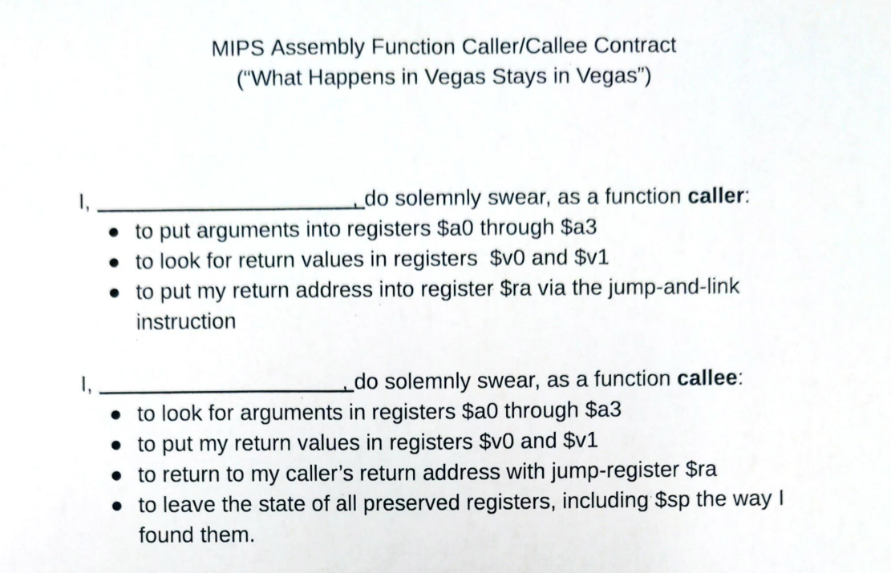

# Topics:
* Subroutines continued
* The stack

# Subroutines
* jal / jr
* stack
* conventions

## Types of Subroutines
* Leaf Subroutine
    * No other subroutine calls

* Non-Leaf Subroutine 
    * Calls Subroutines

**Examples**:

* Example 1:
    * Psuedocode

            int min3(int x, int y, int z)
                {
                    int min = x
                    if y < min:
                        min = y
                    if z < min:
                        min = z
                    return min
                }

    * Assembly

            min3:   
                    move $t0 $a0
                    slt $t1 $a1 $a0
                    beq $t1 $0 if1
                    move $t0 $a1

            if1:    
                    slt $t2 $a2 $t0
                    beq $t2 $0 returnmin
                    move $t0 $a2
            
            returnmin:    

                    jr $ra

* Continued from Example 1:

    * Preconditions

            a = 3
            b = 2
            c = 1
            d = min3(a,b,c)

    * Assembly

            li $s0 3
            li $s1 2
            li $s2 1

            # Move arguments into registers

            move $a0 $s0
            move $a1 $s1 
            move $a2 $s2

            # Jump and link, with the assumption that the returned value 
            # should use registers

            jal min3
            
            move $s4 Sv0

* Example 2

    * Preconditions

            d = min(3,2,1)
            a = d + 5
            b = min(5, 6, 7)

    * Compiled in Assembly

            # Load Arguments for `d` into $a registers
            li $a0 3
            li $a1 2
            li $a2 1

            jal min3
            move $s4 $v0

            addi $s0 $s4 5

            li $a0 5
            li $a1 6
            li $a2 7

            jal min3
            move $s1 $v0

* Reminder from previous class

        jal <label>

        $RA <--- PC + 4
        $PC <--- label

        jr $ra 
        $PC <--- $RA

### Restructured Variant of MIN3

* Preconditions

    * min2 function

            min2:

                $v0 <--- min(a0, a1)
                jr $ra

* Psuedocode

        int min3(int x, int y, int z)
            {
                mymin = min(x,y)
                mymin = min(mymin, z)
                return mymin
            }

* Assembly

        min3: 
            jal min2        # jump and link args to min2
            move $t0 $v0
            move $a0 $t0
            move $a1 $a2
            jal min2

            lw $RA 0($sp)   # Now loading from stack
            add $sp $sp 4   # Move stack pointer down by 4 to next item

            jr $ra

*What if we want to call **min3** from main?*

* Assembly

        main:
            li $a0 3
            li $a1 2
            li $a2 1
            jal min3
            move $s4 $v0    #PC + 4

***Where do we store temporary varaiables / data during subroutine calls?***

# THE STACK

*What is the stack?*

* **The stack is a safe place of unallocated memory where we can safely stash things**
* **Is always pointing to a special register `$sp`**
* `$sp` is always pointing to the `top` of the stack

## Mechanisms of usage for the stack
* `Push`
            
        addi $sp $sp -4
        sw <what we want to store> 0($sp)

* `Pop`

        lw <what we want to load> 0($sp)
        addi $sp $sp 4

**What is the stack most essential for?**

Subroutines that call other subroutines.

AKA....

# **RECURSION**

#
# 2/15/2023 Subroutines Continued

* The Stack
* Recursion
* Oath

## Subroutine Convention
* scope

**Across a subroutine call, we take a leap of faith**

We must trust that

* Certain registers are preserved
    * $sp
    * $RA
    * $s0 ... $s7

## Subroutines:

* If non-leaf --> **They have to push the return address ($RA) onto the stack**
* If they modify $s0 ... $s7 - **must be restored**

main: 

                li $t0 4                # load immediate
                addi $SP $SP 4
                sw $t0 0($SP)
                    
            --> jal foo
                : 
                lw $t0 0($SP)
                add $SP $SP 4

**OATH**

**Example**

C -Code: **Factorial**

        int Fact( int n )
        {
                if (n==0){
                        return 1
                }
                else{
                        return n * Fact(n-1)
                }
        }

**Recursive subroutines are ALWAYS non-leaf**
* `$SP` is `Stack-Pointer`

**How to multiply?**

--> Use assembly command `mul`

Assembly:

        main:
                li $a0 5
                jal fact
        
        fact: 
                bne $a0 $0 else
                li $v0 1
                jr $ra

        else:                           # We are shift back by -8 bc two spots
                addi $SP $SP -8         # Push 2 move values onto stack
                sw $RA 4($SP)           # Making room and then preseve $ra
                sw $a0 0($SP)

                addi $a0 $a0 -1
                jal fact

                lw $a0 0($SP)           # Pop a value off
                addi $SP $SP 4

                mul $v0 $v0 $a0

                lw $ra 4 ($SP)
                addi $SP $SP 8

                jr $ra

**the Stack**, visualized:

        $v0:
        $a0: 5
        $RA: ***

                |                       |
                |                       |
                |                       |
                |                       |
                |                       |
                |                       |
                |           *           |
        $SP --> |           5           |
                |           ~           |
                 _______________________

**the HEAP**, visualized
                 
                 _______________________
                |                       |
                |                       |
                |                       |
                |                       |
                |                       |
                |                       |
                |           *           |
        $SP --> |           5           |
                |           ~           |

#

# Linked Lists

Each node has:
* Its own data
* A pointer to the next node

# Some info on CPUs

                 [    ]   [     ]
        [ IF ] > [ RR ] > [ ALU ] > [ DM ] > [ WB ]
                 [    ] > [     ]

Where:
* IF = 
* RR = 
* ALU = 
* DM = 
* WB = 

# Class Exercise
                
