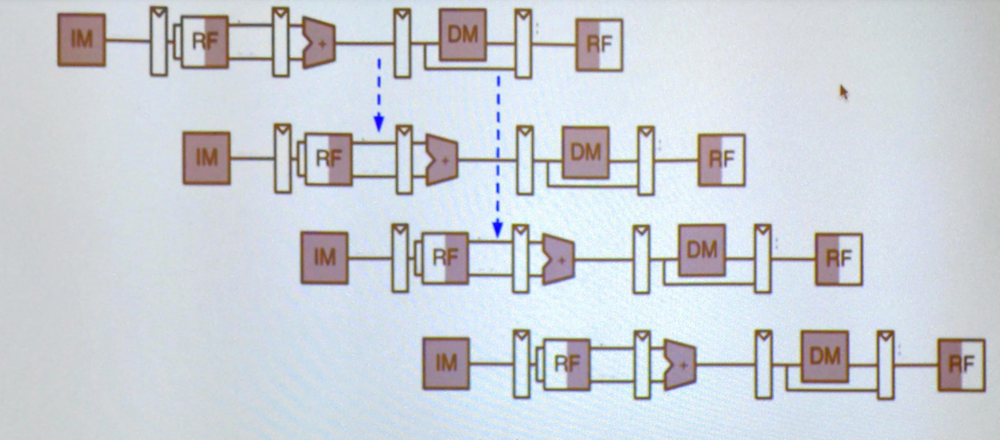

# Topics

* Pipelines
* Hazards
* Parallelizm

## Definitions

* Throughout: Instructions per unit time
* Latency: Time for 1 instruction to complete

## Examples of differen clock rates:

|   Clock Rate  | Stages  | Rate | Throughput | Latency |
|---------------|---------|------|------------|---------|
|     1000      |    1    |1/1000| 1/1000     | 1000    |
|     500       |    2    |1/500 | 1/500      | 1000    |
|     250       |    3    |1/250 | 1/250      | 1000    |
|     N         |    N    |N/1000| N/1000     | 1000    |
|     250         |    5    |1/250 | 1/250     | 1250   |

* Clock rate is determined by the longest latency stage
* Pipeline stages are not all equal units of time
 
# 

## Hazards

* Data Hazard:
    * When an instruction reads from a register that a prior is writing to
    - Still in the pipeline

Example Assembly:

    addi $t0 $t1 $t2
    sub  $t3 $t3 $t0
    or   $t4 $t0 $t1

Done in hardware:

* A Hazard Unit: Keeps track of which input of muxes in a cpu needs to be selected from

Example 2:

    lw $t0 (***)
    add $t2 $t0 $t1

* Compilers will nowadays move / reorder code to maximize the efficiency of the circuit

---------------------------

### Branches are expensive

* Why?
    * Everytime we run a branch it needs to see if it needs to branch or not and then jump resulting in a wait of 2 clock cycles

Example 3:

        add $t0 $t1 $t2
        beq $t0 $0 end
        sub _ _ _
        or _ _ _ 
        and _ _ _
    end: sw _ _ _

Control Hazard:
* Dont know which instruction to fetch next

Example 4:

        li $t0 0
        li $t3 10
    for: beq $t0 $3 endloop
        ~~~~~~~
        ~~~~~~~
        ~~~~~~~
        addi $t0 $t0 1
        j for
    end:

vs ...

    j test
    foo: ______
         ______
         ______
    test: bne _ _ foo

### Branch Prediction

    

